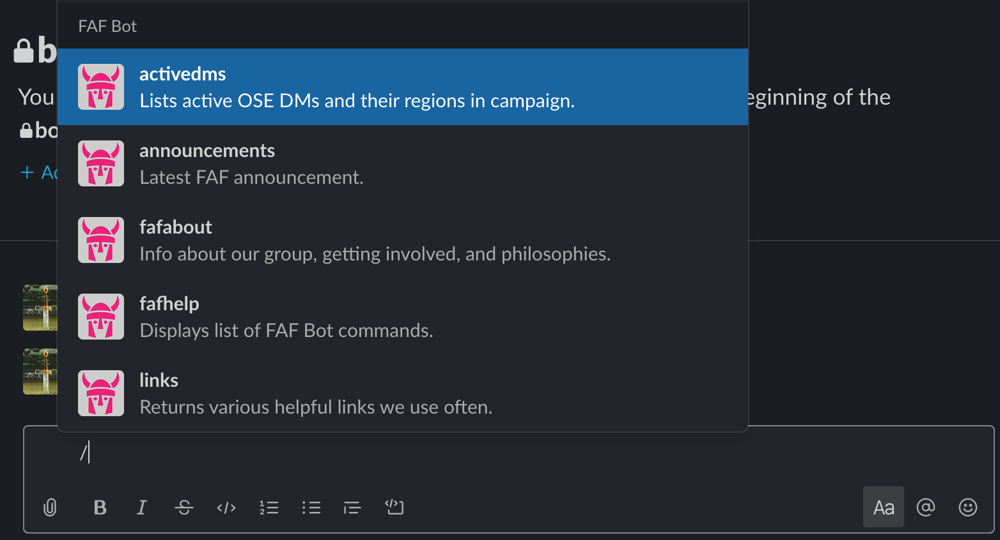
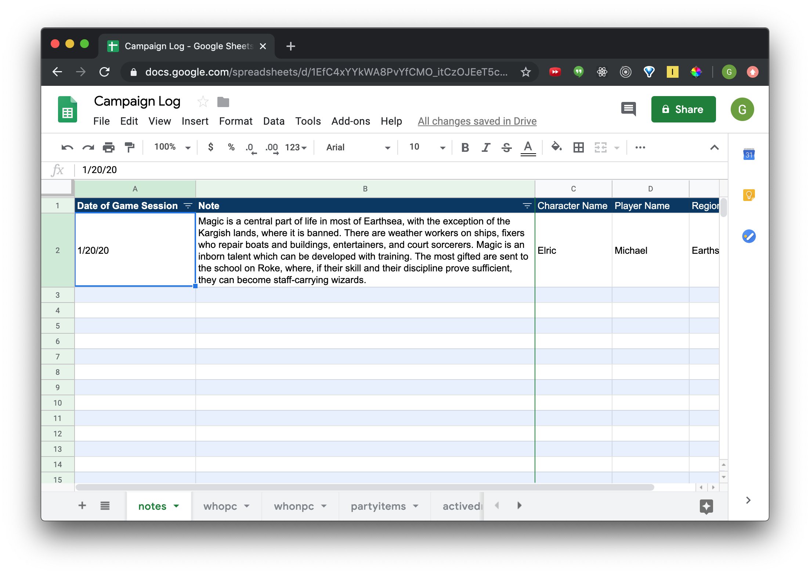
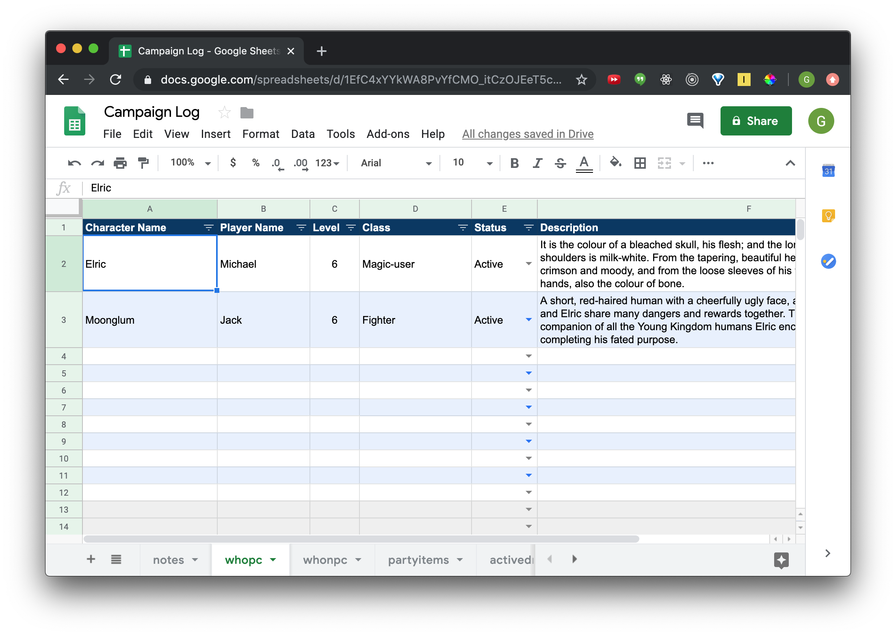
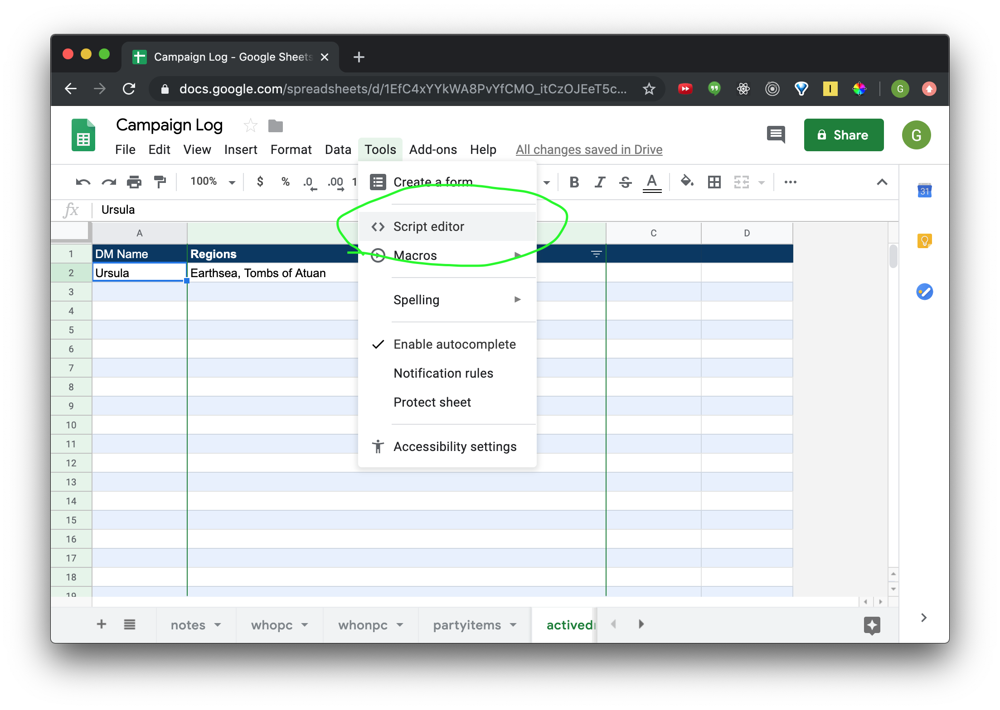
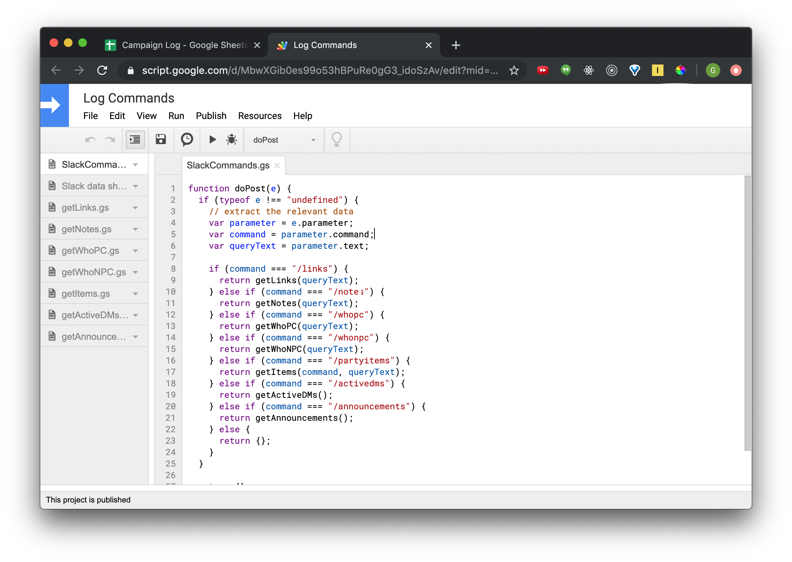
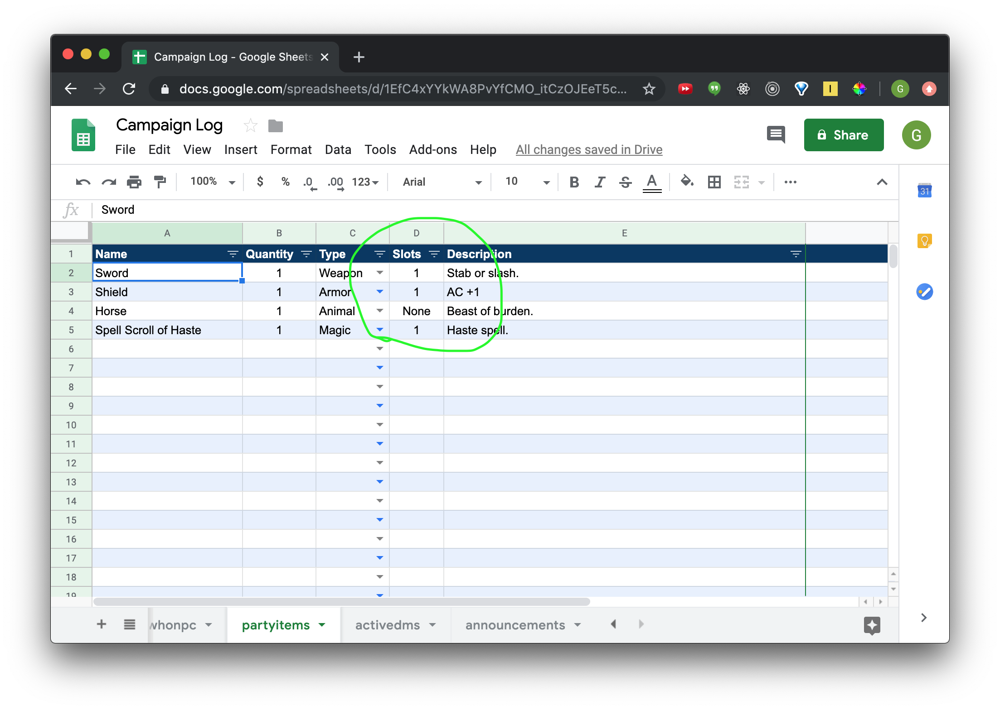

- [x] What we will be doing (overview):
- [x] explain why use Slack instead of Discord (what my group is comfortable with, already used for a local boardgame group and most employers)

- **What we are actually doing**
- creating a slack workspace
- adding an app to it
- making a copy of my google drive sheet with google scripts (hopefully don't need to recreate)
- go over what some of the google scripts do, what the data format looks of a slack command etc.
- adding slash commands using the google scripts link to the slack app bot
- invite bot to workspace and demonstrate it working

- [x] create a slack workspace (beyond scope of this article)
- [x] add app to it
- [x] instruct to copy of google drive sheet with mock data and google scripts (remove oxcart)
- [] go over script switch statement and slack api data shape looks like
- [] add "CAMPAIGN LOG LINK GOES HERE PLACEHOLDERS" links to script in /whopc, etc
- [] we use a slot system for our items, that column can be changed to display weight (Also change it in the getItems function)
- [] mention Block Kit and how we use it in the script response to make the data returned nicely presented [Block Kit for Slack](https://api.slack.com/block-kit) We could make it even nicer if we wanted to, look at all those lovely options!
- [] explain how Block Kit can be used to format some of the commands to display things like useful links (say roll20 or whatever)
- [] add slash commands to slack app bot
- [] invite bot to workspace and demo it working with a gif or two
- [] lots of ways to customize your workspace further: add a dice roller bot, add greet bot, and add an icon for your bot
- [] mention David Walsh blog about adding data to a google sheet

Add a cool image for your bot from open source game icons [open source game icons](https://game-icons.net/)

David Walsh blog [David Walsh blog](https://davidwalsh.name/using-slack-slash-commands-to-send-data-from-slack-into-google-sheets)


### What are we doing?

~~We~~ _You_ are going to create a Slack workspace for an open table roleplaying group and _we_ are going to go over adding a custom Slack App to this workspace with the goal of leveraging slash commands powered by a Google Apps Script. The Google Apps Script will use a Google Sheet as an accessible repository of campaign info, sort of like a simple database or content managment system. The group I run, which at the time of writing this boasts almost 30 members, uses a similar setup to maintain a list of active DMs, PCs/NPCs, announcements, party items, session notes, etc.

##### It will behave like this when complete.

##### This app has the potential for many useful options. FAF is the acronym for our gaming group (Fantastic Adventures & Friends), and FAF Bot is the name of the app created for this workspace.

> **Why Slack and not Discord?**  
> This basically comes down to personal preference and what most of my gaming group is already comfortable with. Many of the members are already familiar with Slack either because of their career or being members of other local meetups that use it.

### 1 - Create a Slack workspace

This is pretty straightforward so I won't go over it here, Slack will walk you through it [here](https://slack.com/help/articles/206845317-Create-a-Slack-workspace).

Add whatever useful channels you might desire beyond "general" and "random". Our group uses a "looking-for-game" channel to arrange games using a shared Google calendar.

### 2 - Add an app to your workspace

When you have created a Slack workspace and are ready to begin creating your app, go [here](https://api.slack.com/apps?new_app=1). All it needs for now is a name and to be associated with your workspace.

### 3 - Copy this Google Sheet

The Google Sheet [here]() contains a tab structure that could be used by various campaigns for recording info and can easily be expanded upon if desired. Some example screenshots of the sheet are below. Follow the link to the sheet and make a copy of it in your own Google Drive account.

##### Players are encouraged in our group to add a brief session note after each session to share important or interesting information with other players and contribute to the shared lore of the game world. 

##### Players add their character to the whopc tab so a record is kept of characters. 

### 4 - The Google Apps Script

##### The Google Apps Script editor can be found here.

##### It will open another window that contains the scripts!

This is gonna get a little technical briefly. The screenshot above shows the `doPost` function, which checks the Slack slash command we will originate from the workspace for a particular `command` string. When we find a matching `command` string we invoke another function to respond appropriately with what the user desires. Sometimes, in the case of `getItems` for example, we also pass `queryText` for further discretion about what our response should contain.

##### There is a bunch of potentially useful info sent from the slash command but for this tutorial we are only concerned with the `command` and `text`.

```
// example slash command
{
  token: 'gIkuvaNzQIHg97ATvDxqgjtO',
  team_id: 'T0001',
  team_domain: 'example',
  enterprise_id: 'E0001',
  enterprise_name: 'Globular%20Construct%20Inc',
  channel_id: 'C2147483705',
  channel_name: 'test',
  user_id: 'U2147483697',
  user_name: 'Steve',
  command: '/listbot',
  text: 'check randomuser@gmail.com',
  response_url: 'https://hooks.slack.com/commands/1234/5678',
  trigger_id: '13345224609.738474920.8088930838d88f008e0'
}
```


