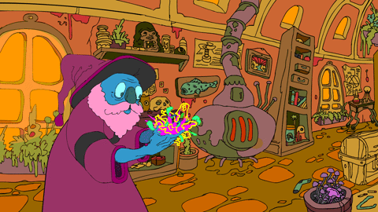

Wild magic-users tap into raw arcane magic and aspire to cast spells without structure for greater effect. To access this power they relinquish the control exercised by conventional magic-users and accept the fluctuating and oftentimes chaotic results of their spells.

### The following as Magic-user:

- **Requirements**
- **Prime requisite**
- **Hit Dice**
- **Maximum level**
- **Armor**
- **Weapons**
- **Languages**
- **Level Progression**
- **Attacks**
- **Saving Throws**
- **Spells**
- **Combat**

### Wild Magic-user Abilities:

**Spell Level Variability**  
The wild magic-user's work with the principles of uncertainty affects all spells that have a level variable for range, duration, area of effect, or damage. Each time a wild magic-user casts or activates a spell with a level variable, they randomly determine the resulting spell level. The player must roll 1d3 at the moment the spell is cast. A result of 1 the spell level is lower, 2 unaffected, and 3 higher. Subtract 1d6 from the spell level (to a minimum of 1) if the result was lower. Add 1d6 to the spell level if higher. A spell level can be higher than 14.

> **Commentary on Spell Level Variability**  
> I definitely prefer simplicity for classes as much as possible, and simplicity overall is a big reason why our gaming group plays Old-School Essentials. The above spell level variability is mechanically simple, but it does mean low-level wild magic-users have little to risk if a cast spell must be lowered in level since the minimum will always be 1. This is fine. Go nuts! Gamble with that magic missile or make light last a ridiculous amount of time if the dice favor you. Chances are high they have a wild surge (below) if they are low-level!

**Wild Surges**  
Wild magic-user spells sometimes unfold in spectacular wild surges that could prove catastrophic to the wild magic-user and their companions. Each time a wild magic-user casts or activates a spell, roll 1d6 on the table below to see if a random magical effect is unleashed. If a wild surge is unleashed, the referee determines the result from an exhaustive table of possible side-effects ([Net Libram of Random Magical Effects](https://centralia.aquest.com/downloads/NLRMEv2.pdf) by Orrex).

At 5th level, a wild magic-user gains the ability to roll twice for every wild surge and choose the result.

| Level | Wild Surge |
| ----- | ---------- |
| 1     | 1-5        |
| 2     | 1-5        |
| 3     | 1-5        |
| 4     | 1-5        |
| 5     | 1-4        |
| 6     | 1-4        |
| 7     | 1-4        |
| 8     | 1-4        |
| 9     | 1-3        |
| 10    | 1-3        |
| 11    | 1-3        |
| 12    | 1-3        |
| 13    | 1-2        |
| 14    | 1-2        |

> **Commentary on Wild Surge**  
> The first part is pretty straightforward. The chance of a wild surge occurring is higher at lower levels and becomes less common at higher levels. Any cast spell has a chance of wild surging (even if it has no level variable effects!).
>
> At 5th level we allow wild magic-users to roll twice for every wild surge and choose the result they want. This accomplishes a couple things:
>
> 1 - It conveys the feeling of a wild magic-user gaining more control over the raw and unstructured magic they cast as they become more disciplined in their lack of discipline.
>
> 2 - There may be times where a wild magic-user is interested in subduing or increasing the chances of a wild surge occurring.

In trying to roll as little as possible at a table, I prefer to click buttons instead.  
[Improbability Drive](https://haa-gg.github.io/Improbability-Drive/) by Glendon Gengel makes it effortless to leverage the chaos of the Net Libram of Random Magical Effects.
